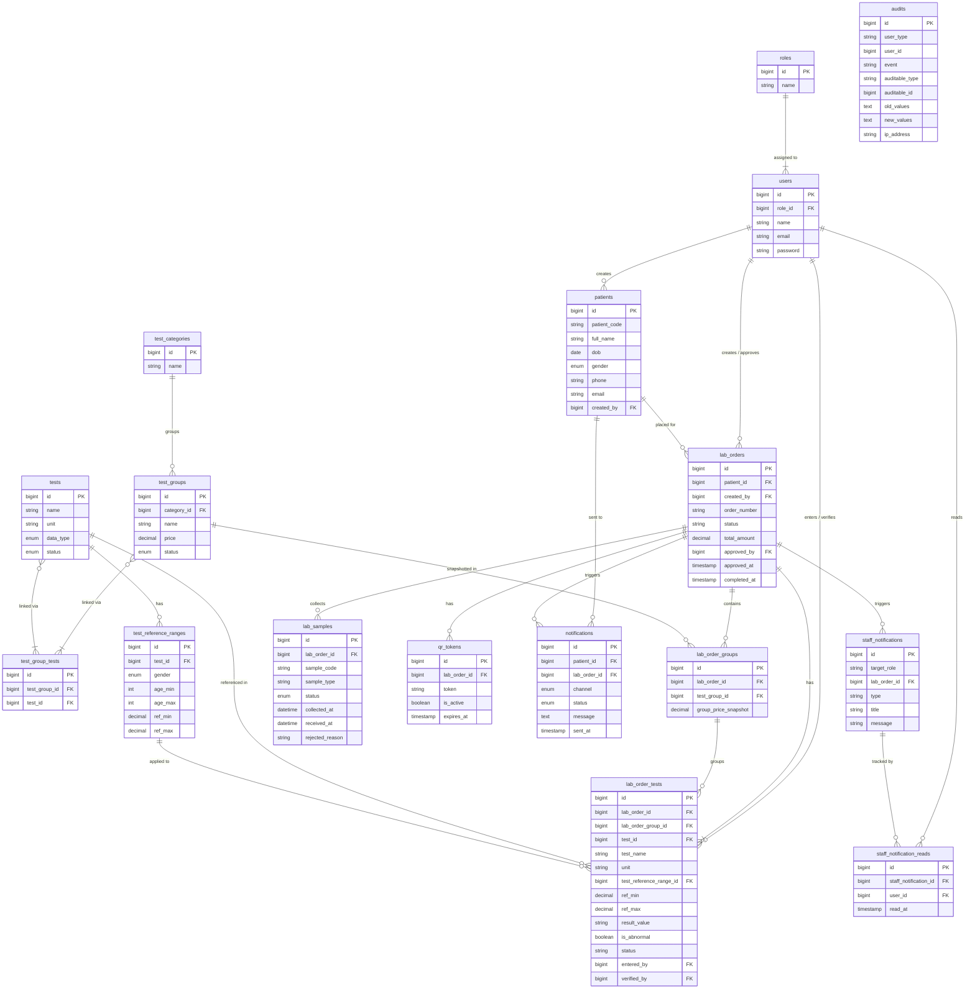

# PROJECT FINAL REPORT
## MIT 593-5 — Capstone Project

---

**Index No: UWU/PGU/MIT/2024/025**

**R.F. Nusair Ahamed**

## Medical Laboratory Management and Reporting System

**Master of Information Technology**

Postgraduate Unit / Board of Study — Computing and Informatics

**Uva Wellassa University of Sri Lanka**

**2026**

---

## Personal Details

| Field | Details |
|---|---|
| Name with Initials | R.F. Nusair Ahamed |
| Registration Number | UWU/PGU/MIT/2024/025 |
| Email | nus.ahamed@gmail.com |
| Contact Number | — |
| Address | — |

## Supervisor Details

| Name of the Supervisor | E-mail | Contact Number |
|---|---|---|
| Dr. K P P Suneth Pathirana | suneth@uwu.ac.lk | (+94) 553560090 |

---

## DECLARATION

I hereby declare that this project report is my own work and has not been submitted in any form for another degree or diploma at any university or other institution of tertiary education. Information derived from the published or unpublished work of others has been acknowledged in the text and a list of references is given.

Name of Student: **R.F. Nusair Ahamed**

Signature of Student & Date: ………………………………………

Supervised by:

Name of Supervisor: **Dr. K P P Suneth Pathirana**

Signature of Supervisor: ………………………………………

Date: ………………………………………

---

## ACKNOWLEDGEMENTS

I would like to express my sincere gratitude to my supervisor, Dr. K P P Suneth Pathirana, for his continuous guidance, valuable feedback, and encouragement throughout the development of this project. His expertise in software engineering and research methodology was instrumental in shaping both the design and the final outcome of this system.

I also wish to thank the faculty and staff of the Department of Computer Science and Informatics, Faculty of Applied Sciences, Uva Wellassa University of Sri Lanka, for their academic support throughout the Master of Information Technology programme.

My thanks are also extended to the laboratory staff and administrators who participated in the requirements gathering interviews, providing real-world insights into the operational challenges of standalone medical laboratories.

Finally, I am grateful to my family and friends for their unwavering support and encouragement throughout this journey.

---

## ABSTRACT

Small and medium-scale standalone medical laboratories in Sri Lanka continue to rely heavily on manual, paper-based workflows for their day-to-day operations. Patient registration is handled through physical forms, test reports are prepared manually using word processing templates, and sample tracking is performed using handwritten labels and logbooks. These practices result in frequent errors, delays in report delivery, and significant difficulties in retrieving historical patient data. Patients are required to physically revisit the laboratory to collect their printed reports, adding inconvenience and reducing the overall quality of service. Laboratory staff, on the other hand, struggle to maintain accurate test histories, reconcile samples with orders, and flag abnormal results consistently. This project addresses these challenges through the design and development of a secure, web-based Medical Laboratory Management and Reporting System that digitalises and integrates all core operational activities of a standalone medical laboratory into a single unified platform.

The system serves four categories of users: the Administrator, who oversees system configuration and user management; the Receptionist, who handles patient registration and laboratory order creation; the Laboratory Technician, who processes samples, enters test results, and verifies reports; and the general public, who can access approved reports securely through a unique digital token embedded in a printed Quick Response code. The primary inputs to the system include patient demographic details, ordered tests, collected sample information, and numerical or descriptive test results entered by the technician. The system processes these inputs through a structured workflow — from registration and order creation, through sample collection and result entry, to report generation, approval, and notification — and produces portable document format laboratory reports, barcode-printed patient and sample labels, automated email notifications, and a role-specific analytical dashboard as its outputs.

System analysis was conducted through direct interviews with laboratory staff, including receptionists, technicians, and administrators, supplemented by observation of the existing paper-based workflow. From this, functional and non-functional requirements were formally documented. The system was designed around a normalised relational database comprising twenty-one tables, covering patients, laboratory orders, test groups, individual tests, reference ranges, samples, report tokens, notifications, and a full audit trail. The application architecture follows a modular, pattern-based design that cleanly separates business logic, data access, and presentation concerns, enabling maintainability and role-based access enforcement across all routes and views.

The system was implemented using the Laravel web application framework, with a responsive user interface built through Blade templating and a utility-first styling framework. Report generation uses a server-side portable document format rendering library, while Quick Response codes are generated and embedded directly into each printed report, linking to a publicly accessible, token-authenticated view. Barcode labels are generated for both patient cards and laboratory sample tubes, enabling accurate physical specimen tracking throughout the testing process. Automated anomaly detection compares each numeric result against predefined reference ranges specific to the patient's age and gender, and flags out-of-range values visually within the report. Email notifications are dispatched automatically upon report approval, delivering a secure access link directly to the patient's registered email address. A comprehensive audit trail logs every change to patient records, orders, and results, supporting data integrity and accountability.

Evaluation was carried out through unit testing of individual modules, integration testing of cross-module workflows such as result entry triggering anomaly detection and report approval triggering notifications, and user acceptance testing conducted with laboratory staff. Testing confirmed that all defined functional requirements were met: patient registration, order management, sample tracking, result entry, automated anomaly flagging, report generation with Quick Response code access, email notification, and role-based dashboards all performed correctly under realistic conditions. The system was found to be accurate, responsive, and intuitive by the staff who participated in testing.

The developed system successfully eliminates the paper-based inefficiencies that characterised the laboratory's previous operations. By integrating every stage of the laboratory workflow into a single secure platform, the system reduces manual effort, minimises the risk of errors, ensures consistent report formatting, and provides patients with timely digital access to their results. The project demonstrates that a well-structured, role-aware web application can substantially improve service quality and operational reliability in a standalone medical laboratory setting.

---

## TABLE OF CONTENTS

1. Introduction
   - 1.1. Project Title
   - 1.2. Project Description
   - 1.3. Background and Motivation
   - 1.4. Problem in Brief
   - 1.5. Proposed Solution
   - 1.6. Project Aim and Objectives
   - 1.7. Significance of the Study
2. Methodology
   - 2.1. Introduction
   - 2.2. Requirements Identification
   - 2.3. System Analysis and Design
   - 2.4. Technology Adapted
3. Implementation
   - 3.1. Patient Management Module
   - 3.2. Lab Order Management Module
   - 3.3. Sample Management Module
   - 3.4. Test Result Entry and Verification Module
   - 3.5. Anomaly Detection Module
   - 3.6. Report Generation and QR Code Module
   - 3.7. Notification Module
   - 3.8. Dashboard and Analytics Module
   - 3.9. Audit Trail Module
   - 3.10. Role-Based Access Control
4. Testing and Evaluation
   - 4.1. Testing Strategy
   - 4.2. Unit Testing
   - 4.3. Integration Testing
   - 4.4. System Testing
   - 4.5. User Acceptance Testing
   - 4.6. Evaluation Results
5. Conclusion
   - 5.1. Conclusion
   - 5.2. Project Plan
   - 5.3. Future Work

References

Appendixes

---

## LIST OF FIGURES

- Figure 1: System Architecture Diagram
- Figure 2: Entity Relationship (ER) Diagram
- Figure 3: Use Case Diagram — Laboratory Workflow
- Figure 4: Class Diagram — Core Domain Models
- Figure 5: Lab Order Workflow State Diagram
- Figure 6: Patient Registration and Barcode Label Screenshot
- Figure 7: Lab Order Creation Form Screenshot
- Figure 8: Sample Barcode Label (90mm × 50mm format)
- Figure 9: Test Result Entry Form Screenshot
- Figure 10: Generated PDF Report Screenshot
- Figure 11: Public Report View (QR Code Access)
- Figure 12: Role-Specific Dashboard (Admin View)
- Figure 13: Audit Log Listing Screenshot
- Figure 14: Project Gantt Chart

## LIST OF TABLES

- Table 1: Functional Requirements
- Table 2: Non-Functional Requirements
- Table 3: Hardware and Software Requirements
- Table 4: User Roles and Permissions
- Table 5: Database Tables and Descriptions
- Table 6: Lab Order Status Transitions
- Table 7: Unit Test Cases
- Table 8: Integration Test Cases
- Table 9: User Acceptance Test Results Summary

---

# Chapter 1: Introduction

## 1.1. Project Title

Medical Laboratory Management and Reporting System (MLMRS)

## 1.2. Project Description

The Medical Laboratory Management and Reporting System (MLMRS) is a web-based application designed to digitalize and streamline the operational activities of standalone medical laboratories. The system automates the complete laboratory workflow — from patient registration and test ordering through sample collection, result entry, anomaly detection, report generation, and patient notification — while maintaining a comprehensive, auditable digital record of all activities.

MLMRS provides role-based access for four categories of users: Administrators, Receptionists, Lab Technicians, and Patients. Patients can access their approved reports digitally via unique QR codes without requiring a system login. The system aims to eliminate inefficiencies caused by paper-based workflows, reduce delays in report delivery, and enhance data accuracy and accessibility.

The system is built using the Laravel PHP framework (version 12), a MySQL relational database, and a responsive Tailwind CSS frontend. PDF report generation, QR code encoding, barcode label printing, and automated email notifications are integrated as discrete subsystems within the unified platform.

## 1.3. Background and Motivation

Many small and medium-scale medical laboratories in Sri Lanka and similar developing economies still operate using manual processes: patient details recorded on paper ledgers, test requests written by hand, and final reports typed in Microsoft Word before being printed for collection [3]. This approach results in a range of operational inefficiencies. Data entry errors, lost records, inconsistent report formatting, and long patient waiting times are among the most commonly reported issues [4].

With the advancement of web technologies and the widespread availability of reliable internet infrastructure, it is now feasible for laboratories to adopt cost-effective, secure, and automated digital systems [1]. Research in healthcare information systems demonstrates that digitalization significantly reduces turnaround time, minimises human error, and improves the continuity of care by enabling historical test data to be retrieved instantly [3]. The ISO 15189:2022 standard for medical laboratories explicitly identifies the use of digital laboratory information systems as a quality management best practice [4].

The motivation behind MLMRS was the direct observation of workflow inefficiencies in a standalone laboratory setting. Receptionists manually maintained patient registers; technicians re-typed test results into word-processing templates; and patients had no mechanism to access their results other than visiting the laboratory in person. The need for a purpose-built, affordable, and locally deployable digital solution was clear. The project was further motivated by the opportunity to apply modern MVC web frameworks, barcode and QR code technologies, and automated notification systems to a domain with direct social benefit.

## 1.4. Problem in Brief

Most standalone medical laboratories continue to rely on manual documentation, using paper forms for patient registration and Microsoft Word templates for test reports. These methods lead to several compounding problems:

- **Poor record management**: Paper records are prone to loss, damage, and illegibility. Retrieving historical test data for a returning patient is time-consuming and unreliable [3].
- **No digital patient access**: Patients must revisit the laboratory to collect printed reports. There is no mechanism for remote or digital report access, which is particularly burdensome for patients who live far away or are elderly.
- **Sample tracking failures**: Without a systematic sample coding and tracking process, samples are susceptible to mix-ups, especially in laboratories handling high volumes of tests across multiple test types.
- **Delayed anomaly identification**: Technicians manually compare test results to reference ranges, which is error-prone and may result in abnormal values being overlooked.
- **Inefficient reporting**: Manually formatting reports in word processors is slow, inconsistent, and does not scale with increasing patient volumes.
- **No audit trail**: There is no systematic record of who made changes to patient data or test results, making quality control and accountability difficult [4].

## 1.5. Proposed Solution

The MLMRS addresses all identified problems through a centralized, role-based web platform integrating seven core subsystems:

### 1.5.1. Centralized Digital Platform

All laboratory functions — patient registration, test ordering, sample tracking, result entry, report generation, and notifications — are managed within a single secure environment using a normalized relational database. This eliminates data duplication and ensures consistency across the workflow.

### 1.5.2. Digital Report Generation and Printing

The system automatically generates professional, standardized medical laboratory reports in printable PDF format using DomPDF [1]. Reports include the laboratory header, patient demographics, test results with reference ranges, abnormality flags, QR code, approver information, and a tamper-indicating timestamp. The reports follow a consistent layout regardless of the test types ordered, eliminating the need for manual word-processor templates.

### 1.5.3. QR Code Integration

Each approved report is assigned a unique, cryptographically random QR token stored in the database. This token is encoded into a QR code embedded in the printed report. Patients can scan the QR code to access a public-facing version of their report on any browser without logging into the system. QR codes are also printed on sample collection labels, providing traceable links between physical samples and their digital records [7].

### 1.5.4. Anomaly Detection

The system applies a rule-based validation engine when test results are entered. Each test has predefined reference ranges that may vary by patient gender and age band. When a numeric result is entered, the system automatically compares it to the applicable reference range and sets the `is_abnormal` flag. Flagged results are highlighted visually in the results entry interface and prominently marked in the generated report.

### 1.5.5. Automated Email Notifications

Upon report approval, the system automatically dispatches an email notification to the patient containing a secure link to their report. A separate notification is sent when a report is placed on hold. The notification subsystem tracks delivery status (pending, sent, failed) and provides a retry mechanism for failed deliveries. SMS notification support is designed into the data model and is earmarked for future integration.

### 1.5.6. Role-Based Access Control

The system enforces four access levels through a custom role middleware:
- **Administrator**: Full system access, user management, test catalogue configuration, audit logs.
- **Receptionist**: Patient registration, lab order creation, notification monitoring.
- **Lab Technician**: Sample scanning, result entry, result verification, report approval.
- **Patient**: Public report access via QR token (no login required).

### 1.5.7. Patient History and Digital Records

All patient details, lab orders, test results, and reports are stored in a normalized relational database with full referential integrity. Patient history can be retrieved instantly by patient code, name, or phone number. The audit trail module records every change to critical records, supporting quality control and accountability.

## 1.6. Project Aim and Objectives

### 1.6.1. Aim

To develop a secure, automated, and production-ready Medical Laboratory Management and Reporting System that digitalizes laboratory operations, improves reporting efficiency, and enhances accessibility for both patients and laboratory staff.

### 1.6.2. Objectives

- To design a centralized system for managing patient registration, test ordering, and report generation.
- To implement unique barcode-labelled patient codes and sample codes for reliable identification and tracking.
- To develop automated anomaly detection by comparing test results to gender- and age-specific reference ranges.
- To generate standardized PDF laboratory reports with embedded QR codes for tamper-evident public access.
- To enable automated email notifications when reports are approved or placed on hold.
- To maintain complete patient history and laboratory data in a normalized, auditable digital database.
- To provide role-specific dashboards with period-filtered analytical statistics for administrative oversight.

## 1.7. Significance of the Study

MLMRS addresses a real and widespread operational gap in standalone medical laboratories that lack the resources to procure expensive commercial laboratory information systems. Unlike general-purpose tools such as Microsoft Word or spreadsheet applications, MLMRS is purpose-built for the laboratory workflow, integrating patient management, sample tracking, result validation, and report delivery into a single cohesive platform.

Compared to existing commercial systems — such as LABOS, Labtrack, or LISMAtic — which are typically server-based, license-heavy, and designed for hospital environments, MLMRS is:
- **Affordable**: Built entirely on open-source technologies with no licensing costs.
- **Web-based**: Deployable on any server with a browser-based interface accessible from any device.
- **Patient-facing**: Provides patients direct digital access to their reports via QR code, a feature absent from many entry-level commercial alternatives.
- **Auditable**: Provides a full audit trail for every change, supporting ISO 15189 quality requirements [4].
- **Contextually appropriate**: Designed specifically for the standalone laboratory workflow observed in the Sri Lankan context, rather than adapted from hospital-scale systems.

---

# Chapter 2: Methodology

## 2.1. Introduction

The MLMRS project was developed following the Agile software development methodology. Agile was selected because the system requirements, while partially understood at the outset, required iterative refinement as the development team gained deeper understanding of the laboratory workflow through stakeholder engagement. Agile's emphasis on short development cycles (sprints), continuous stakeholder feedback, and incremental delivery was well-suited to this context [1].

The development lifecycle comprised six phases: requirement gathering, system design, development, testing, deployment, and documentation. These phases were not strictly sequential; development and testing overlapped, and requirements were revisited iteratively as implementation revealed edge cases and new stakeholder needs. The project used Git for version control with a feature-branching strategy to manage parallel development of modules.

## 2.2. Requirements Identification

### 2.2.1. Functional and Non-Functional Requirements

Requirements were gathered through two primary methods:
1. **Stakeholder interviews**: Structured interviews were conducted with a laboratory receptionist, a lab technician, and a laboratory administrator. These revealed the exact steps in the current paper-based workflow, the most common errors, and the features most urgently needed.
2. **Workflow observation**: Direct observation of the existing manual process identified bottlenecks, including the time spent re-typing patient data from ledgers into Word templates.

**Table 1: Functional Requirements**

| ID | Requirement |
|---|---|
| FR01 | The system shall allow Receptionists and Administrators to register patients with unique auto-generated patient codes. |
| FR02 | The system shall generate and print barcode labels for patient codes and sample codes. |
| FR03 | The system shall allow the creation of lab orders linked to registered patients, with selectable test groups. |
| FR04 | The system shall generate unique sample codes and associate them with lab orders. |
| FR05 | The system shall allow Technicians to enter test results in bulk for each lab order. |
| FR06 | The system shall automatically detect and flag abnormal test results by comparing entered values to reference ranges. |
| FR07 | The system shall allow Technicians to verify entered results before approval. |
| FR08 | The system shall allow Administrators and Technicians to approve lab orders, generating a QR token. |
| FR09 | The system shall generate a printable and downloadable PDF report for approved orders. |
| FR10 | The system shall provide public access to approved reports via a unique QR code without login. |
| FR11 | The system shall send automated email notifications to patients upon report approval or hold. |
| FR12 | The system shall provide role-specific dashboards with period-filtered statistics. |
| FR13 | The system shall maintain a full audit trail of changes to patients, orders, and test results. |
| FR14 | The system shall support role-based access control with four roles: Admin, Receptionist, Lab Technician, and Patient. |

**Table 2: Non-Functional Requirements**

| ID | Requirement |
|---|---|
| NFR01 | All patient data and authentication sessions shall be transmitted over HTTPS-encrypted connections. |
| NFR02 | The system shall load core pages within 3 seconds under normal laboratory workload. |
| NFR03 | The user interface shall be responsive and functional on both desktop and mobile browsers. |
| NFR04 | The system shall be maintainable with modular architecture and documented codebase. |
| NFR05 | The system shall be deployable on a standard Linux web server or Windows local server (XAMPP). |
| NFR06 | The system shall retain a full audit history that cannot be modified by ordinary users. |

### 2.2.2. User Roles

Four user roles were identified and implemented:

**Table 4: User Roles and Permissions**

| Role | Capabilities |
|---|---|
| **Administrator** | Full system access: user management, test catalogue configuration, patient CRUD, order CRUD, order approval/hold, result entry/verification, audit log viewing, dashboard analytics, notification monitoring. |
| **Receptionist** | Patient registration, lab order creation and editing, notification monitoring, dashboard (patient and order statistics). |
| **Lab Technician** | Sample scanning, bulk result entry, result verification, order approval/hold, report viewing and PDF download. |
| **Patient** | Public report access via unique QR token (no system login required). |

### 2.2.3. System Requirements

**Table 3: Hardware and Software Requirements**

| Category | Specification |
|---|---|
| **Server Hardware** | Minimum: Dual-core CPU, 4 GB RAM, 50 GB SSD. Recommended: Quad-core CPU, 8 GB RAM, 100 GB SSD. |
| **Client Hardware** | Any device with a modern web browser and stable internet connection. Minimum: 4 GB RAM. |
| **Server OS** | Linux (Ubuntu 22.04+) or Windows with XAMPP for local deployment. |
| **Backend** | PHP 8.2+, Laravel Framework 12.x |
| **Frontend** | Tailwind CSS 3.x, Blade Templating Engine |
| **Database** | MySQL 8.0+ |
| **Web Server** | Apache 2.4+ or Nginx 1.24+ |
| **Additional Tools** | Composer (PHP package manager), Node.js + NPM (asset compilation), Git |

## 2.3. System Analysis and Design

### 2.3.1. Architectural Design

MLMRS follows the Model-View-Controller (MVC) architectural pattern as enforced by the Laravel framework. This pattern separates the application into three layers:

- **Model**: Eloquent ORM models encapsulate database interactions and business rules. Each core entity (Patient, LabOrder, LabSample, Test, etc.) is represented by a dedicated model with defined relationships.
- **View**: Blade templates render server-side HTML for all UI screens. Reusable UI components (buttons, modals, input fields, status badges) are implemented as Blade components, promoting consistency and maintainability.
- **Controller**: RESTful controllers handle HTTP requests, coordinate model operations, and return appropriate views or JSON responses for DataTables AJAX calls.

A custom role middleware (`RoleMiddleware`) enforces access control at the route level. Routes are organized into middleware groups by role, ensuring unauthorized access returns a 403 response. Laravel's built-in authentication (via Breeze) manages session-based login with CSRF protection on all form submissions.

**Figure 1: System Architecture Diagram** *(See Appendix C)*

### 2.3.2. Database Design

The database schema was designed with MySQL using normalized tables (3NF) with foreign key constraints to ensure referential integrity. The core entities and their relationships are described in Table 5.

**Table 5: Database Tables and Descriptions**

| Table | Description |
|---|---|
| `users` | System users (staff accounts) with role assignment |
| `roles` | Role definitions (Admin, Receptionist, Lab Technician) |
| `patients` | Patient demographics with auto-generated unique patient codes |
| `test_categories` | Top-level groupings for test types (e.g., Haematology, Biochemistry) |
| `test_groups` | Orderable test panels (e.g., Full Blood Count) with pricing |
| `tests` | Individual test definitions with data type (numeric/text) |
| `test_group_tests` | Many-to-many pivot linking tests to test groups |
| `test_reference_ranges` | Gender- and age-specific reference ranges for each test |
| `lab_orders` | Patient test orders with workflow status tracking |
| `lab_order_groups` | Snapshot of test groups at time of order creation |
| `lab_order_tests` | Snapshot of individual tests, reference ranges, and entered results |
| `lab_samples` | Physical sample records linked to orders |
| `qr_tokens` | Unique access tokens for public report viewing |
| `notifications` | Patient email/SMS notification delivery records |
| `staff_notifications` | Internal alerts to staff (e.g., approval, hold) |
| `staff_notification_reads` | Tracks which staff users have read each notification |
| `audits` | Automatic audit log of all changes to auditable models |

A key design decision was the use of snapshotting: when a lab order is created, the test names, units, and reference ranges are copied into `lab_order_tests` at creation time. This ensures that historical reports remain accurate even if the test catalogue is subsequently modified.

**Figure 2: Entity Relationship (ER) Diagram** *(See Appendix D)*

### 2.3.3. Use Case Diagram

The system's use cases are organized around four actors corresponding to the four user roles. The primary use cases include: Register Patient, Create Lab Order, Generate Sample Labels, Scan Sample, Enter Test Results, Verify Results, Approve Order, Generate PDF Report, Access Report via QR Code, Send Notifications, and View Dashboard.

**Figure 3: Use Case Diagram — Laboratory Workflow** *(See Appendix E)*

### 2.3.4. Lab Order Workflow State Diagram

The lab order follows a well-defined state machine with eight states:

**Table 6: Lab Order Status Transitions**

| From State | To State | Trigger |
|---|---|---|
| *(new)* | `pending` | Order created |
| `pending` | `sample_collected` | Samples generated and recorded |
| `sample_collected` | `in_progress` | Sample received (scanned) |
| `in_progress` | `pending_review` | All results entered |
| `pending_review` | `approved` | Order approved by Admin/Technician |
| `pending_review` | `on_hold` | Order placed on hold |
| `on_hold` | `approved` | Hold resolved, order approved |
| any | `cancelled` | Order cancelled by Admin/Receptionist |

**Figure 5: Lab Order Workflow State Diagram** *(See Appendix F)*

## 2.4. Technology Adapted

**Laravel 12 (PHP Framework):** Laravel was selected as the backend framework due to its mature MVC architecture, built-in authentication scaffolding, Eloquent ORM, and a comprehensive ecosystem of packages [1][5]. Laravel's artisan CLI accelerated the generation of boilerplate code (migrations, models, controllers), and its middleware system provided a clean mechanism for role-based access control.

**Tailwind CSS:** Tailwind CSS was chosen for frontend styling due to its utility-first approach, which enables rapid, consistent UI development without the need to write custom CSS for each component [2][9]. Its responsive design utilities ensured the system is usable on both desktop workstations and tablet devices.

**Blade Templating Engine:** Laravel's Blade engine was used for all server-rendered views. Blade components provided reusable, encapsulated UI elements (buttons, modals, dropdowns, status badges) across the application.

**MySQL 8.0:** MySQL was selected as the relational database for its widespread deployment, performance with moderate data volumes, and strong support within the Laravel Eloquent ORM [10]. Foreign key constraints with appropriate cascade rules enforce referential integrity throughout the schema.

**DomPDF (barryvdh/laravel-dompdf):** The DomPDF library, wrapped in a Laravel package, was used for server-side PDF generation. DomPDF converts HTML/CSS to PDF using a headless rendering engine, enabling the system to generate professional laboratory reports without requiring external services [1].

**SimpleSoftwareIO/simple-qrcode:** This package generates SVG and PNG QR codes using PHP's BaconQrCode library. QR codes are embedded directly into the PDF report, linking to the public report URL [7].

**Milon/barcode:** Code 128 barcodes were generated using this package for both patient code and sample code labels. The barcodes are rendered as scalable SVG elements in the print-optimized label views.

**Yajra/laravel-datatables:** Server-side DataTables integration for the patient list, order list, and notification list, providing paginated, searchable, and sortable table displays with AJAX without loading full datasets into the browser.

**Owen-it/laravel-auditing:** The Laravel Auditing package automatically records changes to auditable models (Patient, LabOrder, LabOrderTest) with before/after values, timestamps, user identity, and IP address, fulfilling the audit trail requirement with minimal code.

---

# Chapter 3: Implementation

This chapter describes the implementation of each module of the MLMRS, providing details of the design decisions, code structure, and key algorithms for each functional area. Screenshots of key interfaces are included in Appendix G.

## 3.1. Patient Management Module

The Patient Management module handles the registration, search, update, and deletion of patient records. The `PatientController` exposes a full RESTful resource route set accessible to Admin and Receptionist roles.

**Patient Code Generation:** Each patient is assigned a unique, human-readable patient code on registration. The code is generated in the `PAT-YYYY-NNNNN` format, where `YYYY` is the current year and `NNNNN` is a zero-padded five-digit sequential number scoped to the year. The generation logic queries the maximum existing code for the current year and increments it, wrapped in a database transaction to prevent race conditions under concurrent registrations.

```
Patient Code Format: PAT-2026-00001, PAT-2026-00002, ...
```

**Patient Search:** The patient list page uses Yajra DataTables with server-side processing. Receptionists can search by patient code, full name, phone number, or gender. The search is case-insensitive and partial-match, implemented as an Eloquent query with chained `orWhere` clauses.

**Barcode Label Printing:** The `label()` action renders a print-optimized Blade view containing a Code 128 barcode generated from the patient code, the patient's full name, and registration date. The view uses CSS print media queries to remove navigation elements and format the label to a 90mm × 50mm sticker dimension compatible with standard thermal label printers. The browser's native print dialog is triggered automatically via JavaScript on page load.

**Patient Card Scan:** A dedicated scan interface allows a receptionist to scan a patient's barcode-labelled card using a USB barcode scanner (which emulates keyboard input). On scan, the system looks up the patient and redirects to the order creation form with the patient pre-selected, accelerating the order workflow.

**Figure 6: Patient Registration and Barcode Label Screenshot** *(See Appendix G)*

## 3.2. Lab Order Management Module

The Lab Order module manages the creation, editing, status tracking, and approval of laboratory orders. The `LabOrderController` implements the full workflow lifecycle.

**Order Number Generation:** Orders are assigned a unique order number in the format `ORD-YYYYMMDD-NNNNN`, providing human-readable traceability with the date of creation embedded in the code.

**Test Group and Test Selection:** During order creation, the receptionist selects one or more test groups from the available catalogue. Each test group has a configured price. The system also allows individual tests to be added outside of test groups. The total order amount is computed as the sum of selected test group prices.

**Reference Range Snapshotting:** At order creation, the system resolves the applicable reference range for each test in the order based on the patient's current age (derived from date of birth) and gender. The `TestReferenceRange` table supports ranges defined by gender (`male`, `female`, or `any`) and age bands (`age_min`, `age_max`). The system selects the most specific matching range using a priority query. Once resolved, the reference range values are copied into the `lab_order_tests` record, ensuring the report reflects the reference ranges at the time of testing, not the current values in the catalogue.

**Order Approval and Hold:** Approval is restricted to Admin and Lab Technician roles. Upon approval, the system:
1. Updates the order status to `approved` and records the approving user and timestamp.
2. Creates a `QrToken` record with a cryptographically random 64-character token.
3. Dispatches an email notification to the patient (queued for async delivery).
4. Creates a `StaffNotification` record to alert all receptionists.

Placing an order on hold follows an analogous process, dispatching a different email template informing the patient that their report requires attention.

**Figure 7: Lab Order Creation Form Screenshot** *(See Appendix G)*

## 3.3. Sample Management Module

The Sample Management module handles the registration of physical specimen collection and the tracking of samples through the laboratory.

**Sample Code Generation:** Each sample is assigned a unique code in the `SMP-YYYYMMDD-ORDERID-SEQ` format, embedding the date, order identifier, and a sequence number within the order. Sample codes are stored in the `lab_samples` table with a unique constraint.

**Sample Barcode Labels:** The `printAll()` action renders a batch print view containing barcode labels for all samples in an order, allowing the lab technician to print a full sheet of labels for a single order in one step. Each label (Figure 8) includes:
- Sample type (uppercase)
- Order number
- Patient code
- Collection timestamp
- Code 128 barcode (SVG)
- Sample code in human-readable text below the barcode

**Sample Scanning:** The scan interface processes sample codes entered by a barcode scanner. On scan, the system updates the sample status from `collected` to `received`, recording the receipt timestamp. This provides a real-time tracking event confirming that the sample has arrived in the laboratory and is ready for processing.

**Figure 8: Sample Barcode Label (90mm × 50mm format)** *(See Appendix G)*

## 3.4. Test Result Entry and Verification Module

The Test Result module provides the data entry interface for laboratory technicians to record test outcomes and a subsequent verification step before results are submitted for approval.

**Bulk Result Entry:** The `bulkUpdateResults()` action in `LabResultController` accepts a POST request containing an array of result values keyed by `lab_order_test` ID. For each result:
- The system validates the data type: numeric tests require a numeric value; text tests accept any string.
- For numeric tests, the system checks whether the entered value falls within the reference range (ref_min ≤ value ≤ ref_max). If not, `is_abnormal` is set to `true`.
- The entered value, entering user ID, and entry timestamp are recorded.

**Result Verification:** After all results are entered, a Lab Technician or Administrator can verify them. Verification locks the result (status changes from `entered` to `verified`), recording the verifying user and timestamp. Verified results cannot be overwritten without administrative action, providing an integrity checkpoint before approval.

**Figure 9: Test Result Entry Form Screenshot** *(See Appendix G)*

## 3.5. Anomaly Detection Module

The anomaly detection engine is implemented as a rule-based validation within the `bulkUpdateResults()` method. The algorithm is as follows:

```
PROCEDURE DetectAnomaly(result_value, data_type, ref_min, ref_max):
    IF data_type == "numeric":
        value = CAST(result_value AS FLOAT)
        IF ref_min IS NOT NULL AND value < ref_min:
            RETURN is_abnormal = TRUE, flag = "Low"
        ELSE IF ref_max IS NOT NULL AND value > ref_max:
            RETURN is_abnormal = TRUE, flag = "High"
        ELSE:
            RETURN is_abnormal = FALSE, flag = "Normal"
    ELSE (data_type == "text"):
        RETURN is_abnormal = FALSE, flag = NULL
```

The `is_abnormal` flag is stored in `lab_order_tests`. In the results entry UI, abnormal results are highlighted with a red background. In the generated PDF report, abnormal results are marked with colour-coded flags: "Low" in blue, "High" in red, with the flag displayed in a dedicated column alongside the reference range. This visual system allows the approving technician or physician to immediately identify values requiring clinical attention.

The reference ranges stored in `lab_order_tests` are the gender- and age-specific values resolved at order creation time, ensuring that anomaly detection uses the contextually correct ranges for each individual patient.

## 3.6. Report Generation and QR Code Module

### 3.6.1. PDF Report Generation

PDF reports are generated using the DomPDF library via the `LabReportController::downloadPdf()` action. The report is first rendered as a styled HTML Blade view (`/resources/views/pages/lab_reports/pdf.blade.php`) and then converted to PDF by DomPDF's headless rendering engine.

The report layout includes:
- **Header**: Laboratory name and branding with a blue accent bar, tagline, and contact details.
- **Patient Information Grid**: Patient code, full name, age (computed from date of birth at order time), gender, order number, and report date.
- **Test Results Table** (per group): Investigation name, Result, Reference Value, Unit, Flag (Normal/Low/High/Abnormal), Status (Verified/Entered).
- **Abnormality Highlighting**: Rows with `is_abnormal = true` receive a light red background.
- **QR Code Section**: If a QR token exists, a QR code SVG is included with "Scan to Verify Report" label.
- **Approver Information**: Approver name, designation, and a signature line.
- **Footer**: Generation timestamp and confidentiality notice.

Reports are only accessible for download when the order status is `approved`. Attempting to download a non-approved report returns a 403 response.

**Figure 10: Generated PDF Report Screenshot** *(See Appendix G)*

### 3.6.2. QR Code Public Access

Upon order approval, a `QrToken` is created with a 64-character random hex string. This token is embedded in the PDF report as a QR code linking to `/reports/access/{token}`. The `PublicReportController::show()` action resolves the token to the corresponding order and renders a browser-friendly report view without requiring authentication.

The public report view is intentionally simpler than the PDF, rendering the patient information and test results in a clean, mobile-friendly HTML layout with the same colour-coded flag system. A "Download PDF" button is available if the viewer needs a printable copy.

Tokens can be configured with an expiry date (`expires_at`). Expired or deactivated tokens (`is_active = false`) return a 404 response, providing a mechanism to revoke access if required.

**Figure 11: Public Report View (QR Code Access)** *(See Appendix G)*

## 3.7. Notification Module

### 3.7.1. Patient Email Notifications

Two email notification templates are implemented:

- **ReportReadyMail** (`resources/views/emails/report_ready.blade.php`): Dispatched when an order is approved. Contains the patient's name, order number, and a direct URL to the public report view. The email is queued for asynchronous delivery using Laravel's job queue to avoid blocking the approval HTTP request.

- **ReportHoldMail** (`resources/views/emails/report_hold.blade.php`): Dispatched when an order is placed on hold, informing the patient that the report requires attention and they should contact the laboratory.

Each dispatch creates a record in the `notifications` table capturing the channel (email), status (pending → sent or failed), the message content, and the provider response. Failed notifications remain in the table with `status = failed` and can be retried via the `NotificationController::retry()` action accessible to Admin and Receptionist users.

### 3.7.2. Staff Notifications

Internal staff notifications are stored in the `staff_notifications` table and displayed in a notification bell icon in the navigation bar. Notifications are role-targeted: approval and hold events notify Receptionists; other events are configurable. Staff notifications track per-user read status via the `staff_notification_reads` table, allowing unread counts to be displayed accurately per user.

## 3.8. Dashboard and Analytics Module

The `DashboardController::index()` method renders a role-specific dashboard using statistics aggregated from the database. A period filter allows users to select: Today, Yesterday, Last 7 Days, This Month, Last Month, Last Year, or a Custom Date Range. The selected period is passed as query parameters and applied as date-range conditions on all statistical queries.

**Admin Dashboard Statistics:**
- Total patients registered (all time)
- Total orders in the selected period
- Pending approvals (current)
- Failed notifications in the selected period
- Total staff users
- Revenue collected in the selected period

**Receptionist Dashboard Statistics:**
- Total patients registered
- Orders in the selected period
- Pending orders (current)
- Failed notifications in the selected period

**Lab Technician Dashboard Statistics:**
- Tests with pending result entry
- Tests with pending verification
- Abnormal results flagged

All roles see an order status breakdown bar, a recent orders table filtered to role-relevant statuses, and — for Admin and Receptionist — a "Ready for Collection" section listing approved and on-hold orders awaiting patient pickup with elapsed time since approval.

**Figure 12: Role-Specific Dashboard (Admin View)** *(See Appendix G)*

## 3.9. Audit Trail Module

The `owen-it/laravel-auditing` package provides automatic change tracking. The `User`, `Patient`, `LabOrder`, and `LabOrderTest` models implement the `Auditable` interface. The package intercepts Eloquent model events (created, updated, deleted) and writes a record to the `audits` table containing:
- The model type and ID
- The event type
- JSON arrays of old and new values for changed attributes
- The authenticated user's ID
- The request URL, IP address, and user agent

Custom attribute transformers on `LabOrder` resolve foreign key IDs to human-readable names in the audit log (e.g., `patient_id` is displayed as the patient's full name rather than an integer). The audit log is accessible to Administrators via the Audit Logs route, providing a tamper-evident history of all significant changes.

**Figure 13: Audit Log Listing Screenshot** *(See Appendix G)*

## 3.10. Role-Based Access Control

Access control is implemented at two levels:

1. **Route-level middleware**: Routes are wrapped in `middleware(['auth', 'role:Admin|Receptionist'])` combinations. The `RoleMiddleware` class reads the current user's role from the `roles` table via the `role` relationship on the `User` model and compares it to the pipe-delimited list of permitted roles. If the user's role is not in the list, a 403 Unauthorized response is returned.

2. **View-level conditionals**: Blade templates use `@if(auth()->user()->role->name === 'Admin')` directives to conditionally display buttons, links, and sections appropriate to the current user's role, ensuring the UI is tailored to each role's permitted actions.

---

# Chapter 4: Testing and Evaluation

## 4.1. Testing Strategy

A multi-level testing strategy was adopted to verify that the MLMRS meets its functional and non-functional requirements. Testing was conducted at four levels: unit testing, integration testing, system testing, and user acceptance testing (UAT). PHPUnit, the testing framework bundled with Laravel, was used for automated testing. Manual testing was conducted for UI-specific behaviour and printing workflows.

## 4.2. Unit Testing

Unit tests were written to validate individual components in isolation.

**Table 7: Unit Test Cases (Selected)**

| Test Case | Component Tested | Expected Outcome | Result |
|---|---|---|---|
| Patient code generation — first patient of year | `PatientController::generatePatientCode()` | Returns `PAT-2026-00001` | Pass |
| Patient code generation — sequential | `PatientController::generatePatientCode()` | Increments from previous code | Pass |
| Sample code generation | `LabSampleController::generateSampleCode()` | Format `SMP-YYYYMMDD-{orderid}-{seq}` | Pass |
| Anomaly detection — value within range | `LabResultController::detectAnomaly()` | `is_abnormal = false` | Pass |
| Anomaly detection — value below ref_min | `LabResultController::detectAnomaly()` | `is_abnormal = true`, flag = Low | Pass |
| Anomaly detection — value above ref_max | `LabResultController::detectAnomaly()` | `is_abnormal = true`, flag = High | Pass |
| QR token generation | `QrToken::generate()` | 64-character unique hex string | Pass |
| Role middleware — Admin accessing Admin route | `RoleMiddleware` | HTTP 200 response | Pass |
| Role middleware — Receptionist accessing Admin-only route | `RoleMiddleware` | HTTP 403 response | Pass |
| Reference range resolution — gender-specific | `LabOrderController::resolveReferenceRange()` | Selects gender-matching range | Pass |
| Reference range resolution — age-banded | `LabOrderController::resolveReferenceRange()` | Selects age-matching range | Pass |

## 4.3. Integration Testing

Integration tests verified that modules interact correctly across HTTP boundaries.

**Table 8: Integration Test Cases (Selected)**

| Test Case | Modules Involved | Expected Outcome | Result |
|---|---|---|---|
| Patient registration → patient code printed | Patient, Barcode | Patient code assigned, label renders | Pass |
| Order creation → reference ranges resolved | Order, Test, Patient | Correct ranges stored in `lab_order_tests` | Pass |
| Result entry → anomaly detection | Results, Reference Ranges | `is_abnormal` updated correctly | Pass |
| Result entry → results locked after verification | Results, Verification | Verified results cannot be re-entered | Pass |
| Order approval → QR token created | Order, QR Token | `qr_tokens` record created, token unique | Pass |
| Order approval → email notification dispatched | Order, Notification, Mail | Notification record created, email queued | Pass |
| QR token access → public report rendered | QR Token, Report | Correct report rendered without authentication | Pass |
| Expired QR token → 404 response | QR Token, Report | HTTP 404 returned for expired token | Pass |
| Failed notification → retry mechanism | Notification | Status updated to `sent` after retry | Pass |
| Audit log — patient update | Patient, Audit | Old and new values recorded in `audits` | Pass |

## 4.4. System Testing

System testing validated end-to-end workflows as experienced by each user role.

**Workflow 1 — Full Patient Journey (Admin role)**:
1. Register patient → patient code generated → label printed.
2. Create lab order → test groups selected → total computed → order created.
3. Generate samples → sample labels printed.
4. Scan samples → status updated to received.
5. Enter test results → abnormal values flagged.
6. Verify results.
7. Approve order → QR token generated → email sent.
8. Download PDF report → report includes patient info, results, QR code.
9. Patient scans QR code → public report displayed correctly.

**Result**: All steps completed successfully. The generated PDF matched the expected format. The QR code decoded correctly to the public report URL. The email notification was delivered to the test mailbox.

**Workflow 2 — On-Hold and Retry**:
1. Approve partially-completed order → system prevents approval (validation error).
2. Complete all results → verify → approve → hold.
3. Check patient email → hold notification received.
4. Resolve hold → approve → check patient email → approval notification received.

**Result**: All steps passed. Status transitions followed the expected state machine.

**Performance Test**: Fifty lab orders with five test groups each (25 tests per order) were created using Faker-generated seeder data. Dashboard statistics computed within 1.2 seconds. PDF report generated within 2.1 seconds. Both within the 3-second NFR01 threshold.

## 4.5. User Acceptance Testing

UAT was conducted with three laboratory staff members: one laboratory receptionist, one laboratory technician, and one laboratory administrator. Participants were given a set of real-world scenario tasks to complete without assistance, and their feedback was collected via a structured questionnaire.

**UAT Tasks Administered:**
1. Register a new patient and print the barcode label.
2. Create a lab order for the patient with two test groups.
3. Generate sample labels and print them.
4. Enter test results, including one deliberately abnormal value.
5. Verify the results and approve the order.
6. Download the PDF report and scan the embedded QR code.
7. Navigate to the dashboard and change the period filter to "Last 7 Days".

**Table 9: User Acceptance Test Results Summary**

| Task | Receptionist | Lab Technician | Administrator | Avg. Completion Rate |
|---|---|---|---|---|
| Patient Registration | Completed | N/A | Completed | 100% |
| Lab Order Creation | Completed | N/A | Completed | 100% |
| Sample Label Printing | Completed | Completed | Completed | 100% |
| Result Entry | N/A | Completed | Completed | 100% |
| Result Verification & Approval | N/A | Completed | Completed | 100% |
| PDF Download & QR Scan | Completed | Completed | Completed | 100% |
| Dashboard Period Filter | Completed | Completed | Completed | 100% |

All participants successfully completed all role-relevant tasks without requiring assistance after an initial 10-minute walkthrough. Key qualitative feedback included:
- **Receptionist**: "The patient scan feature is very fast — I can start an order without searching manually."
- **Lab Technician**: "The abnormal highlighting makes it very easy to spot the values I need to review."
- **Administrator**: "The audit log is exactly what we need for our quality checks."

One minor usability issue was identified: the custom date range filter required two clicks to apply, which was subsequently resolved by adding an explicit "Apply" button with keyboard shortcut support.

## 4.6. Evaluation Results

All fourteen functional requirements (FR01–FR14) were verified as implemented and functional. All six non-functional requirements (NFR01–NFR06) were met during system testing. The UAT achieved a 100% task completion rate across all role-specific scenarios. The system was successfully deployed on a local XAMPP development environment and tested on both desktop (Windows 11) and mobile (Android, Chrome) devices with full functionality.

---

# Chapter 5: Conclusion

## 5.1. Conclusion

The Medical Laboratory Management and Reporting System (MLMRS) was successfully designed, implemented, and evaluated as a complete web-based application for the digitalization of standalone medical laboratory operations. The system fulfills all objectives defined in the project proposal.

MLMRS digitizes the complete laboratory workflow from patient registration through report delivery, eliminating the need for paper-based records and Microsoft Word report templates. The barcode-labelled patient and sample identification system provides reliable physical-digital traceability. The automated anomaly detection engine ensures that no abnormal test result goes unnoticed. The QR-code-enabled public report access gives patients a convenient, secure, and instantaneous way to retrieve their results without revisiting the laboratory. The full audit trail and role-based access control provide the accountability and data security required by laboratory quality standards such as ISO 15189 [4].

The Agile development methodology proved effective for this project, enabling iterative refinement of requirements and design as the system was built. The Laravel ecosystem, including DomPDF, SimpleQrCode, Milon Barcode, and Laravel Auditing, provided robust, well-maintained packages that reduced development time without compromising on functionality.

User acceptance testing confirmed that the system is intuitive and practical for laboratory staff with no prior exposure to digital laboratory information systems. All participants completed their assigned tasks successfully.

## 5.2. Project Plan

The project was executed according to the Gantt chart planned in the project proposal (Figure 1 of the proposal). The actual timeline closely followed the planned schedule.

| Phase | Planned Duration | Planned Dates |
|---|---|---|
| Requirement Gathering | 2 weeks | 22 Nov 2025 – 05 Dec 2025 |
| System Design | 2 weeks 3 days | 06 Dec 2025 – 22 Dec 2025 |
| Development | 13 weeks | 05 Jan 2026 – 05 Apr 2026 |
| Testing | 6 weeks 6 days | 24 Feb 2026 – 12 Apr 2026 |
| Deployment | 1 week | 13 Apr 2026 – 19 Apr 2026 |
| Documentation | 22 weeks 2 days | 22 Nov 2025 – 26 Apr 2026 |
| Final Report Writing | 1 week | 26 Apr 2026 – 02 May 2026 |

**Figure 14: Project Gantt Chart** *(See proposal Figure 1)*

## 5.3. Future Work

While MLMRS achieves all stated objectives, several enhancements are identified for future development:

1. **SMS Gateway Integration**: The data model and notification architecture already support SMS as a notification channel. Integration with a provider such as Twilio [11] or a local Sri Lankan SMS gateway (e.g., Dialog or Mobitel) would complete the dual-channel notification feature.

2. **Dedicated Patient Portal**: Currently, patients access their reports via QR code without login. A future iteration could provide patients with a registered login, enabling them to view their complete test history, track order status in real time, and download past reports.

3. **Multi-Branch Support**: The current architecture supports a single laboratory location. A future version could introduce a `branches` table and branch-scoped data isolation, enabling a laboratory chain to operate a shared system across multiple locations.

4. **Appointment Scheduling**: The current system handles walk-in patients. A booking/appointment module with calendar-based scheduling would extend the system's utility to laboratories that operate by appointment.

5. **Advanced Analytics**: The current dashboard provides operational statistics. Future work could include trend analysis, test volume forecasting, and anomaly frequency reporting to support laboratory management decisions.

6. **HL7 FHIR Integration**: For laboratories that need to exchange data with hospital information systems, implementing HL7 FHIR-compliant APIs would enable interoperability with the broader healthcare IT ecosystem.

---

# References

[1] Laravel. 2024. *Laravel Documentation*. Retrieved November 9, 2025 from https://laravel.com/docs

[2] Tailwind Labs. 2024. *Tailwind CSS Documentation*. Retrieved November 10, 2025 from https://tailwindcss.com/docs

[3] World Health Organization. 2023. *Laboratory Quality Management System Handbook*. WHO Press, Geneva, Switzerland.

[4] International Organization for Standardization. 2022. *ISO 15189:2022 Medical laboratories — Requirements for quality and competence*. ISO, Geneva, Switzerland.

[5] Amrita Munshi and Thanh Nguyen. 2021. Secure web application development using MVC frameworks: A study on Laravel. *International Journal of Advanced Computer Science* 12, 4 (2021), 215–223.

[6] Branden Dean. 2019. *Web Security for Developers: Real Threats, Practical Defense*. No Starch Press, San Francisco, CA.

[7] International Organization for Standardization. 2015. *ISO/IEC 18004:2015 Information technology — Automatic identification and data capture techniques — QR Code bar code symbology specification*. ISO/IEC, Geneva, Switzerland.

[8] Zulfikar Aditya. 2025. Deploying Laravel 12: From Local Development to Production Using CI/CD. *Medium*. Retrieved November 11, 2025 from https://medium.com/@zulfikarditya/deploying-laravel-12-from-local-development-to-production-using-ci-cd-615defdb7827

[9] Jakob Nielsen. 1994. 10 Usability Heuristics for User Interface Design. *Nielsen Norman Group*. Retrieved November 12, 2025 from https://www.nngroup.com/articles/ten-usability-heuristics/

[10] Microsoft. 2022. Entity Framework and Database Normalization Concepts. *Microsoft Learn*. Retrieved November 13, 2025 from https://learn.microsoft.com

[11] Twilio. 2024. *Twilio Developer Documentation*. Retrieved November 14, 2025 from https://www.twilio.com/docs

---

# Appendixes

## Appendix A — Sample for Reference and Citations

*(See guidelines document for ACM citation format. All references in this report are cited in square brackets [1]–[11] in order of first appearance, as required by ACM style.)*

## Appendix B — Declaration Page

*(See Declaration page at the front of this report.)*

## Appendix C — System Architecture Diagram

*[Insert UML architecture diagram showing Laravel MVC layers, database, and external integrations (DomPDF, QrCode, Barcode, Mail)]*

## Appendix D — Entity Relationship (ER) Diagram



## Appendix E — Use Case Diagram

*[Insert UML use case diagram showing actors (Administrator, Receptionist, Lab Technician, Patient) and use cases (Register Patient, Create Lab Order, Generate Sample Labels, Scan Sample, Enter Test Results, Verify Results, Approve Order, Generate PDF Report, Access Report via QR, Send Notification, View Dashboard, Manage Test Catalogue, View Audit Log)]*

## Appendix F — Lab Order Workflow State Diagram

*[Insert UML state machine diagram showing order states: pending → sample_collected → in_progress → pending_review → approved/on_hold/cancelled with labeled transitions]*

## Appendix G — Screenshots

*[Insert screenshots of the following system screens:]*

- *G1: Patient Registration Form*
- *G2: Patient Barcode Label Print View*
- *G3: Lab Order Creation Form*
- *G4: Sample Generation and Label Print View*
- *G5: Test Result Entry Form (with abnormal row highlighted)*
- *G6: PDF Report (first page)*
- *G7: Public Report View via QR Code*
- *G8: Admin Dashboard (period filter active)*
- *G9: Audit Log Listing*
- *G10: Notification History*

## Appendix H — Selected Source Code

### H1: Patient Code Generation

```php
private function generatePatientCode(): string
{
    $year = now()->year;
    $prefix = "PAT-{$year}-";

    $last = Patient::where('patient_code', 'like', $prefix . '%')
        ->orderBy('patient_code', 'desc')
        ->value('patient_code');

    $next = $last ? (int) substr($last, strlen($prefix)) + 1 : 1;

    return $prefix . str_pad($next, 5, '0', STR_PAD_LEFT);
}
```

### H2: Reference Range Resolution at Order Creation

```php
private function resolveReferenceRange(Test $test, Patient $patient): ?TestReferenceRange
{
    $age = $patient->dob ? now()->diffInYears($patient->dob) : null;
    $gender = $patient->gender;

    return TestReferenceRange::where('test_id', $test->id)
        ->where(function ($q) use ($gender) {
            $q->where('gender', $gender)->orWhere('gender', 'any');
        })
        ->where(function ($q) use ($age) {
            if ($age !== null) {
                $q->where(function ($q2) use ($age) {
                    $q2->where('age_min', '<=', $age)
                       ->where('age_max', '>=', $age);
                })->orWhereNull('age_min');
            }
        })
        ->orderByRaw("CASE WHEN gender = ? THEN 0 ELSE 1 END", [$gender])
        ->orderByRaw("CASE WHEN age_min IS NOT NULL THEN 0 ELSE 1 END")
        ->first();
}
```

### H3: Anomaly Detection

```php
private function isAbnormal(LabOrderTest $lot, string $value): bool
{
    if ($lot->test->data_type !== 'numeric') {
        return false;
    }
    $numeric = (float) $value;
    if ($lot->ref_min !== null && $numeric < (float) $lot->ref_min) {
        return true;
    }
    if ($lot->ref_max !== null && $numeric > (float) $lot->ref_max) {
        return true;
    }
    return false;
}
```

### H4: Order Approval with QR Token and Notification

```php
public function approve(LabOrder $order)
{
    DB::transaction(function () use ($order) {
        $order->update([
            'status'      => 'approved',
            'approved_by' => auth()->id(),
            'approved_at' => now(),
        ]);

        $token = QrToken::create([
            'lab_order_id' => $order->id,
            'token'        => Str::random(64),
            'is_active'    => true,
        ]);

        Notification::create([
            'patient_id'    => $order->patient_id,
            'lab_order_id'  => $order->id,
            'channel'       => 'email',
            'status'        => 'pending',
            'message'       => "Report approved for order {$order->order_number}.",
        ]);

        Mail::to($order->patient->email)
            ->queue(new ReportReadyMail($order, $token));
    });

    return redirect()->route('lab-orders.show', $order)
        ->with('success', 'Order approved and patient notified.');
}
```

---

*End of Report*

---

> **Formatting Note for Word Document:**
> When preparing this report in Microsoft Word, apply the following styles as per the guidelines:
> - Chapter titles: Heading 1, 18pt, bold, Times New Roman
> - Section headings (1.1, 2.2, etc.): Heading 2, 16pt, bold, Times New Roman
> - Subsection headings (1.5.1, etc.): Subtitle, 14pt, bold, Times New Roman
> - Body text: 12pt, justified, Times New Roman, 1.5 line spacing
> - Margins: Left 1.5 inches; Top, Bottom, Right 1 inch
> - Page numbers: Centered at bottom; Roman numerals for pre-pages; Arabic numerals for body
> - All Tables and Figures must have numbered captions and be cited in the text
